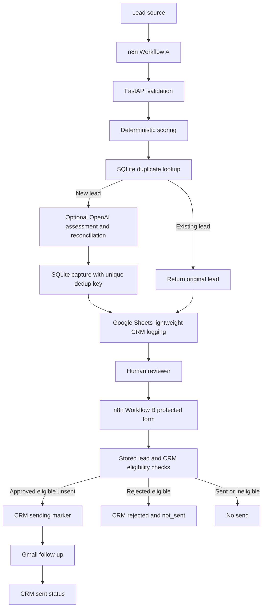

# Lead Generation Agent architecture

MASTER BUILD 04 includes internal Builds 1-5; it does not implement MASTER BUILD 05.

FastAPI owns lead identity and qualification. The pure rubric scores commercial
bands and message signals; AI cannot supply a numeric score. Reconciliation moves
qualification at most one level; low intent/poor fit takes precedence, and final
priority/action derive from the final label. Failed AI assessment retains the
baseline and cannot block capture. SQLite uniqueness protects normalized email +
service identity; duplicate requests return original records without rerunning AI.
Workflow A matches CRM by lead_id; existing rows bypass upsert without state resets.

## Trust boundaries and controls

| Boundary | Trust and control |
| --- | --- |
| Lead input -> API | Untrusted input; Pydantic constraints, enums and extra-field rejection. Free text remains untrusted. |
| API -> SQLite | SQLAlchemy persistence and unique dedup key; generic DB errors; key excluded from public responses. Local API is unauthenticated. |
| API -> OpenAI | Optional; name/email fields excluded, only commercial fields sent. Free text can still contain personal data. Strict structured output, timeout, fallback, no AI score. |
| API/n8n -> Sheets | Private lightweight CRM, not transactional authority. lead_id matching and RAW writes; check mappings after schema refresh. |
| Reviewer -> Workflow B | Basic Auth; fetch canonical stored lead, validate decision and eligibility, do not trust submitted recipient data. |
| Workflow B -> Gmail | Human approval and sending marker before send; sent marker only after success. Stored recipient and deterministic template. |

Credentials remain local; .env and SQLite files are ignored. Sanitized inactive
workflow templates have placeholders, no credential references. Saved n8n execution
data is minimized; provider errors and free text can still be private. Do not share
raw histories. Status guards prevent sequential resends of sent/sending leads.

## Limits

Sheets lookup/write is not atomic. Concurrent intake/approvals can race; Gmail
retries after ambiguous success can duplicate delivery. A failed post-send update
requires manual reconciliation. No exactly-once or zero-failure guarantee exists.
The local backend has no public authentication, production migration/deployment,
or named-reviewer audit trail. Only Google Sheets CRM logging is implemented.
Build 4 evidence is operator-reported live acceptance; offline tests do not prove
new provider execution. See the demo runbook for a safe presentation path.
