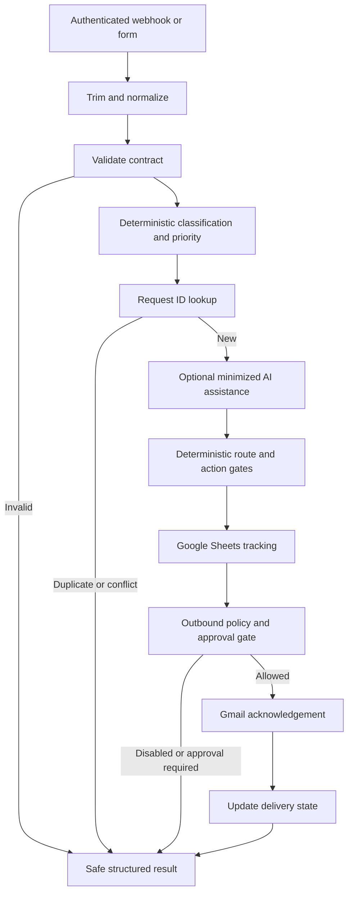

# Architecture

Build 2 implements this graph in an inactive sanitized template with offline checks.
Native import/live acceptance is pending; see [Build 2 notes](BUILD_2_NOTES.md).
Duplicate lookup precedes AI to avoid unnecessary external processing. The sequence
does not provide an atomic transaction across Sheets and Gmail.

| Boundary | Required control |
| --- | --- |
| Business input -> n8n | Authenticated intake; bounded strict fields, fixed source/type enums; no input-supplied credentials, recipients other than validated customer email, or arbitrary URLs |
| n8n -> AI provider | Opt-in; send request_type and redacted message only, never structured name/email/company/IDs; bounded structured suggestions; failure preserves baseline |
| n8n -> Sheets | Private per-client sheet; match request_id; RAW cell format; minimal metadata/status; no raw provider responses, original messages or credentials |
| Reviewer -> n8n | Authenticated approval bound to stored request and response version; client input cannot self-approve |
| n8n -> Gmail | Explicit email enablement, durable sending marker and approved eligibility; sender from local credential, fixed acknowledgement template, no AI-authored outbound text |

Use one isolated client deployment/configuration and sheet per client. Do not share
dedup state or credentials across clients. BUSINESS_NAME supplies a template label,
not authorization. GOOGLE_SHEET_ID selects local storage. EMAIL_ENABLED and
AI_ENABLED default false; invalid boolean configuration fails closed. OPENAI_MODEL
must be explicitly selected if AI is enabled; a missing key/model means fallback.
No .env loader or credential provisioning is implemented. Build 2 maps these settings
to a trusted config literal and native credential/document selectors.

Planned CRM columns: request_id, payload_fingerprint, classification, priority, route,
action, status, email_status, customer_name, email, company, source,
requires_response, approval_status, response_version, created_at, updated_at,
sent_at. Fingerprints remain internal and are not anonymization. Retention and
access controls must be agreed with the client; do not retain raw execution data
by default. Keep AI summaries out of shared evidence.

Before any send, verify the stored record and approval state again. Mark sending
before Gmail and sent only afterward. An ambiguous outcome becomes unknown and
requires reconciliation. Disable automatic Gmail retries; retries of reads may use
bounded backoff. Sheets/Gmail are not transactional, so serialize the MVP and do
not claim race-safe exactly-once behavior. Production concurrency needs an atomic
claim/idempotency store or an equivalent proven mechanism, outside Build 1.
