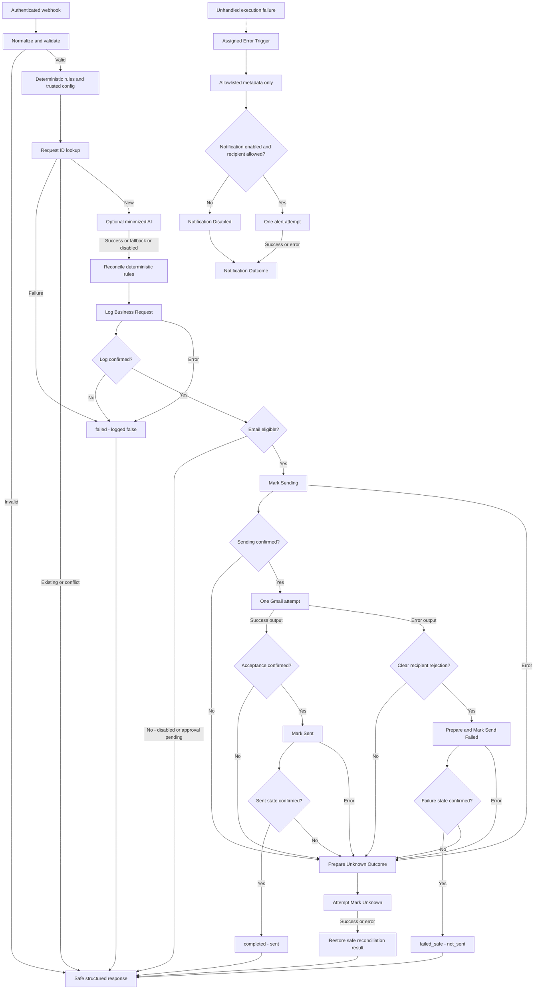
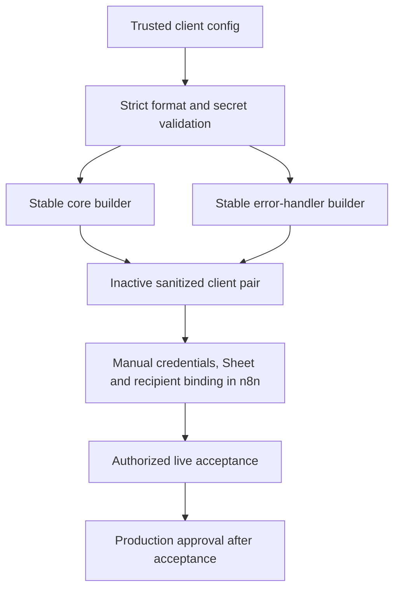

# Architecture

Build 2 implements this graph; Build 3 adds a Gmail acknowledgement gate and a
separate privacy-safe error handler. Both templates are inactive with offline checks.
The operator confirmed five live acceptance scenarios; see [Build 2 notes](BUILD_2_NOTES.md).
Duplicate lookup precedes AI to avoid unnecessary external processing. The sequence
does not provide an atomic transaction across Sheets and Gmail.

| Boundary | Required control |
| --- | --- |
| Business input -> n8n | Authenticated intake; bounded strict fields, fixed source/type enums; no input-supplied credentials, recipients other than validated customer email, or arbitrary URLs |
| n8n -> AI provider | Opt-in; send request_type and redacted message only, never structured name/email/company/IDs; bounded structured suggestions; failure preserves baseline |
| n8n -> Sheets | Private per-client sheet; match request_id; RAW cell format; minimal metadata/status; no raw provider responses, original messages or credentials |
| Review boundary | Billing/complaint remain pending; authenticated approval resumption is deferred, and client input cannot self-approve |
| n8n -> Gmail | Explicit email enablement, durable sending marker and approved eligibility; sender from local credential, fixed acknowledgement template, no AI-authored outbound text |

Use one isolated client deployment/configuration and sheet per client. Do not share
dedup state or credentials across clients. BUSINESS_NAME supplies a template label,
not authorization. GOOGLE_SHEET_ID selects local storage. EMAIL_ENABLED and
AI_ENABLED default false; invalid boolean configuration fails closed. OPENAI_MODEL
must be explicitly selected if AI is enabled; the placeholder skips AI, and transport/credential failures use unavailable.
No .env loader or credential provisioning is implemented. The client generator maps
validated build-time settings to trusted literals and uses native credential/document selectors.

The implemented 24-column schema is documented in the
[core setup guide](../n8n/workflow_core/README.md). Fingerprints remain internal and
are not anonymization. Retention and
access controls must be agreed with the client; do not retain raw execution data
by default. Keep AI summaries out of shared evidence.

Before any send, confirm logging and configured eligibility. Mark sending
before Gmail and sent only afterward. An ambiguous outcome becomes unknown and
requires reconciliation. Build 3 disables Gmail retries and requires a valid
success acknowledgement before Mark Sent, superseding the historical Build 2 live
retry setting. AI/Sheets retain 3 attempts with 2000 ms waits. Sheets/Gmail are not transactional, so serialize the MVP and do
not claim race-safe exactly-once behavior. Production concurrency needs an atomic
claim/idempotency store or an equivalent proven mechanism, outside Build 1.

Workflow-level failures invoke the separately selected Error Trigger workflow.
Handled provider error branches return safe results without necessarily invoking
that trigger. No real error-workflow ID is exported. See
[Build 3 reliability](BUILD_3_RELIABILITY.md) for import setup and trust boundaries.

Build 3 live acceptance A-H is operator-confirmed. Gmail error output now splits
into clear recipient rejection (confirmed failed_safe/not_sent/send_failed) and
ambiguous delivery (needs_reconciliation/unknown, operator review, no resend).
Existing sent/sending/unknown rows retain state and sent_at without writes. The
shared handler false branch reaches Notification Outcome as disabled, with Always
Output Data OFF on its IF. See the reliability document for conservative matching
and the non-atomic Sheets/Gmail limitations.

## Build 4 configuration boundary

The generator embeds validated data using JSON serialization. It never evaluates
configuration as code or merges intake data into config. Feature flags control
existing gates; safety nodes and connections do not vary between clients. Routes
are labels, not external destinations. The ten-field public response is unchanged,
except route values now follow configured labels for new rows. Valid existing rows
retain stored routes across configuration changes without writes or sends.

Canonical builders read the example config; generated client pairs use the same
builders with a unique slug/path. Configure credentials and document selectors only
in n8n. Metadata is onboarding-only, not copied into public responses or AI input.
The handler keeps its fixed safe workflow label and allowlisted stage metadata;
client-specific naming identifies its imported workflow without adding caller data.
See [configuration](CLIENT_CONFIGURATION.md) and [onboarding](CLIENT_ONBOARDING.md).
